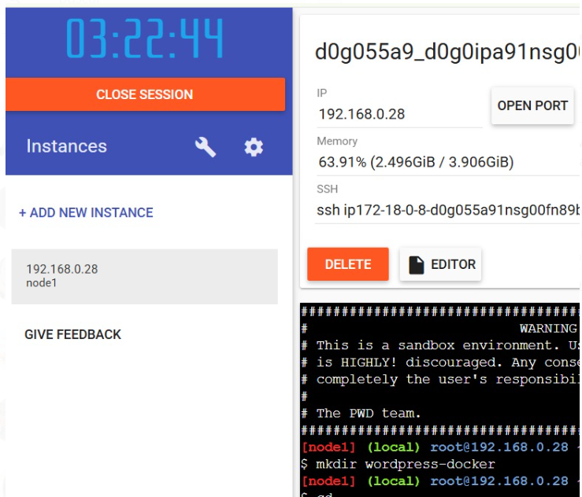

# Practica servidor web
## 1. Titulo
Configuración de docker-compose
## 2. Tiempo de duración
8 horas 
## 3. Fundamentos:
Mysql: Se utiliza la imagen configurando las variables de entorno necesarias para la base de datos, como la contraseña del usuario root y el nombre de la base de datos.

Wordpress: Utiliza la imagen oficial de WordPress de docker hub. Se configura para que se conecte a la base de datos MySQL con las variables de entorno correspondientes.

Phpmyadmin: Este servicio usa la imagen oficial de phpMyAdmin para la gestión de la base de datos de forma visual.

Red: Se define una red llamada wordpress_network, que asegura que los servicios puedan comunicarse entre sí.

Volúmenes: Se crean dos volúmenes persistentes:

  mysql_data: Para almacenar de manera persistente los datos de la base de datos de MySQL.

  wordpress_data: Para almacenar los archivos de WordPress, como temas y plugins.

Docker compose.yml: es un archivo de configuración utilizado por Docker Compose, una herramienta que permite definir y ejecutar aplicaciones multicontenedor. Con Docker Compose, puedes configurar varios contenedores Docker que forman parte de una misma aplicación (por ejemplo, una aplicación web con una base de datos y una interfaz de administración), y orquestarlos de forma fácil y eficiente.

## 4. Conocimientos previos.
   
Para realizar esta practica el estudiante necesita tener claro los siguientes temas:
- Contenedores.
- Puerto de salida.
- Ip.
- Documento docker-compose.yml

## 5. Objetivos a alcanzar

- Configurar variables de entorno ddentro del documento docker-compose.yml

- Crear una red personalizada que asegure que los contenedores de WordPress y MySQL puedan comunicarse de manera efectiva y segura. 

- Definir una red personalizada en Docker permite configurar cómo se conectan los contenedores entre sí. En este caso, la red wordpress_network es utilizada para permitir la comunicación entre WordPress y MySQL.

- Definir volúmenes persistentes en Docker para asegurar que los datos críticos no se pierdan cuando los contenedores se reinicien o eliminen.
## 6. Equipo necesario:
  
- Computador con sistema operativo Windows/Linux
- Plataforma Docker playground o desktop
- Docker hub

## 7. Material de apoyo.
   
- Documentacion de tendencias tecnologicas.
- Docker desktop
- Videos ilustrativos
- Documentacion sobre la configuracion del documento docker-compose.yaml.
  
## 8. Procedimiento
Paso 1:se crea la instancia y se crea una carpeta donde se colocara el archivo compose.yml
 

Paso 2:Ingresamos a la carpeta y creacion el archivo Docker-compose.yml que tiene las deficiones de los servicios que se van a desplegar  
 

Paso 3: En el archivo que acabamos de crear agregamos las definiciones. para esto podemos utilizar el editor que dispone el ambiente de Dockerplay groud

paso 4: Con el comnado cat validamos el contendio que se cargo correctamente

paso 5: creamos una caprtea donde vamos a colocar el archivo del compose y las carpetas que servirán como carpetas locales para que usen los volúmenes de los servicios 

paso 6: validamos que se cargo de manera satisfactoria las definiciones

paso 7: ejecutamos el comando docker-compose up -d para descargar las imágenes necesarias y desplegar los servicios

paso 8: validamos el servicio  phpmyadmin que se configuro que se levante sobre el puerto 8081 y con las credencias user : root pass: rootpass

paso 9:Podemos ver que el servicio esta ejecutándose correctamente, ahora ingresamos las credenciales

paso 10: podemos ver la instancia mysql esta operativa y que  la base WordPress esta creada , esta base se configuro en el archivo compose

paso 11: Podemos ver que el servicio de wordpress esta para la configuracion. 

paso 12: Diagrama con puertos
 

## 9. Resultados esperados:
    
Despues de esta práctica podemos concluir que toda la configuracon de todas dependencias que requiera mi aplicacion la puedo colocar dentro de un m ismo archivo, en este caso el archivo docker-compose.yml.

## 10. Bibliografía
    
Docker Inc. (2024). Docker Documentation. https://docs.docker.com/

Docker Inc. (2024). What is Docker?. https://www.docker.com/resources/what-container/

Turnbull, J. (2021). The Docker Book: Containerization is the new virtualization (5ª ed.). James Turnbull.

WordPress Foundation. (2024). WordPress.org. https://wordpress.org/

audio:

<audio controls>
  <source src="media/nota.ogg" type="audio/ogg">
 
</audio>
